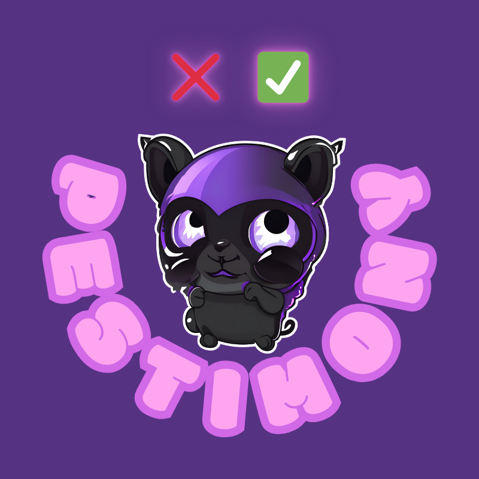
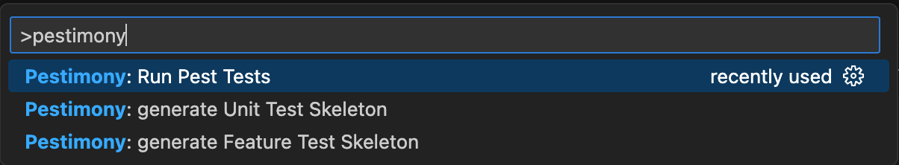
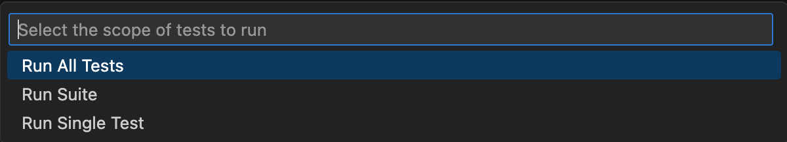
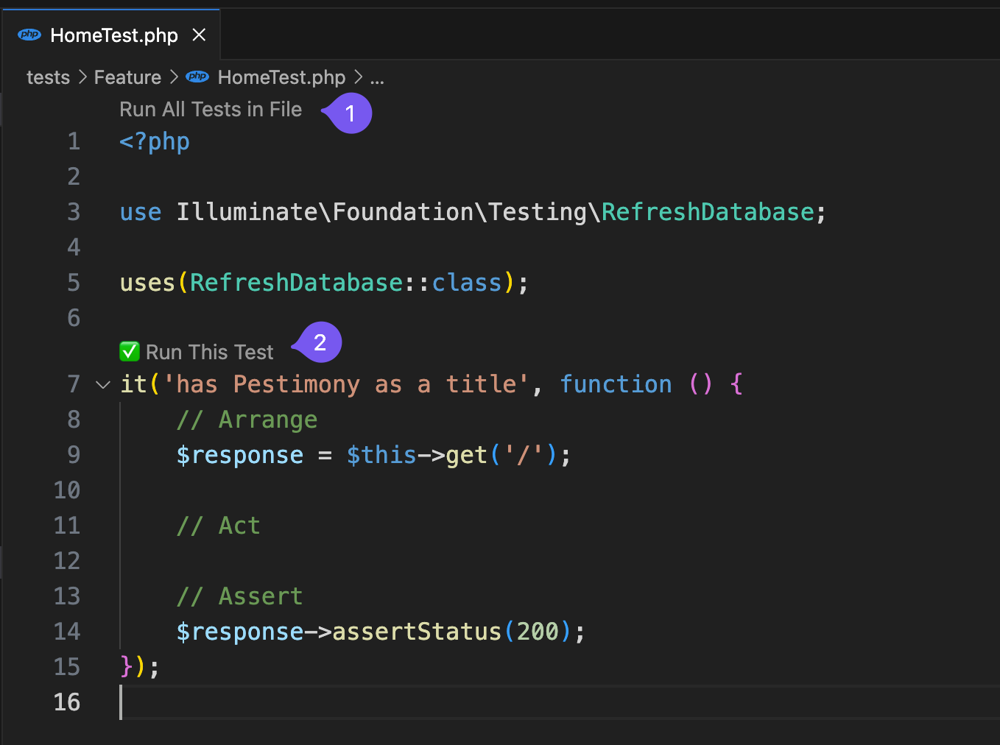

# Pestimony

**A Visual Studio Code plugin to help to deal with PestPHP.**

Currently, directly in VSCode, it can help you to :

- generate feature test with user interaction for filename, name of the test and asking if the test has to have RefreshDatabase Trait
- generate unit test with user interaction for filename, name of the test
- run single test
- run a tests suite
- run all tests
- rerun failed tests only
- visualize easily the tests passed and tests failed

## Available methods

All methods are available via the Palette by searching 'Pestimony'.

### Run Pest Tests

You can run test by menu in Palette or directly in your tests files.

When you choose to run the tests via the Palette, Pestimony offers you to choose the scope of tests to run : 

#### Run All Tests

Will run every tests of your application.

#### Run Suite

Let you choose the suite of test you want to run.

#### Run Single Test

Run tests on the file currently active in the editor.

**Nota : currently when tests are launched by Palette, their status don't appeat in source code. This is a bug, I'm working on.**

If you prefer, run tests directly in code :

you can choose to :

- run all tests contained in the current file (1)
- run a test individually (2)

If a test passed, it will be marked with ✅, if not it will be marked with ❌.

**Rerun only failed tests**

When one or more tests failed, you can rerun only failed tests: 

### Generate Feature Test Skeleton

This command will generate for you a new test under the feature test folder.

If folder does't exists, it will created for you.

It asks you if you want to integrate refreshDatabase trait or not.

It also asks you the name of the first test you want integrate in the file.

### Generate Unit Test Skeleton

This command will generate for you a new test under the unit folder test.

If folder does't exists, it will created for you.

## TODO

- [ ] FEATURE - Add a keyboard shortcut to launch Pestimony commands more easily
- [ ] BUG - Fix the bug with tests whose status is not updated in source files when the test is launched from the VSCode Palette

